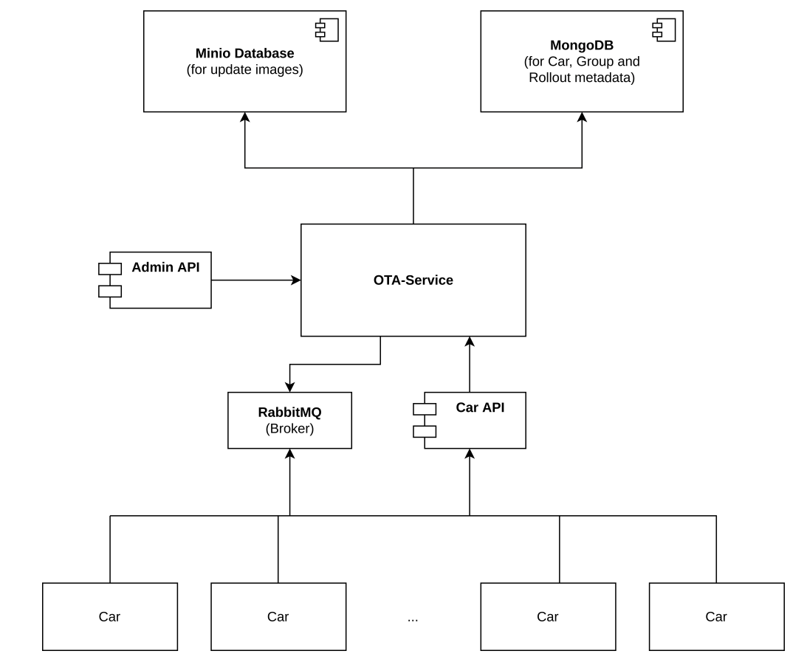

# OTA 5G Hackathon

The OTA 5G Hackathon Challenge aims at realizing a more realistic scenario for Over-the-Air Software Updates for cars.
It is part of [SofDcar Hackathon II](https://sofdcar.de/language/de/sofdcar-hackathon-ii).
In this repo, we collect all the neccessary inputs that are required to complete the challenge. 

## OTA Prototype 

<figure>
  
  <figcaption>Figure 1: Architecture of the Prototype (source: Ingo Schwendinger)</figcaption>
</figure>

The OTA Prototype is a collection of software components developed as part of a bachelor's thesis to assess the impact on Quality of Service (QoS) for various Over-The-Air (OTA) update strategies.
The prototype encompasses two different implemented versions: one without messaging (ota-tester-polling-intervals), and one with messaging (ota-tester-with-broker).
Additionally, it includes a load-generating component equipped with programmed simulation scenarios for updating car fleets of varying sizes.

The services are implemented as Spring Boot Java Applications, while the load generator, which simulates the clients, utilizes Gatling and Scala.
An overview is give in Figure 1.
For more detailed information about each component and the bachelor thesis, please visit https://github.com/PingPong3107/QoS-Analysis-of-OTA-Update-Approaches.

## Hardware

### Laptops as 5G Clients

* 5G driver (Windows recommended, https://www.tekmodul.de/download/quectel/drivers/Quectel_Windows_USB_Driver(Q)_NDIS_V2.7.6.zip)
* We provide 3 laptops (with drivers pre-installed?)
* We provide 3 5G TCUs
* TCUs are connected via USB to the laptops
* SIM cards with static IPs for entering the Nokia 5G Network included
* Participants may use their own devices (laptops with 5G TCU or 5G-capable smartphones) to increase the number of clients but need to install the drivers

### Laptop as 5G Edge Server

* Windows 11 operating system
* Connected via fourth 5G TCU
* Serves as edge in advanced use case

### Edge Core

* [action item] Clarify access with Nokia regarding measurements

## New Features

### Default Scenario Features

* Distributed local deployment for the 5g clients
* Deploy the server locally in one of the machines in the arena that is also connected to the 5g network. 
* Create a protocol/or deployment diagram once the number of clients and the connection has been tested.
* Conducting 5g measurements
  * latency
  * throughput 
  * upload/download rate
  * gatling measurements 

### Advanced Features

* Introduce an Edge cache
* Move current 5G Edge server to the cloud

* Firewall? 
* CS cluster connected to arena, OR server on the public cloud.

## Contact

- Miles Stötzner
- https://miles.stoetzner.de
- miles.stoetzner@iste.uni-stuttgart.de

- Matthias Weiß
- https://www.ias.uni-stuttgart.de/institut/team/Weiss-00019/
- matthias.weiss@ias.uni-stuttgart.de